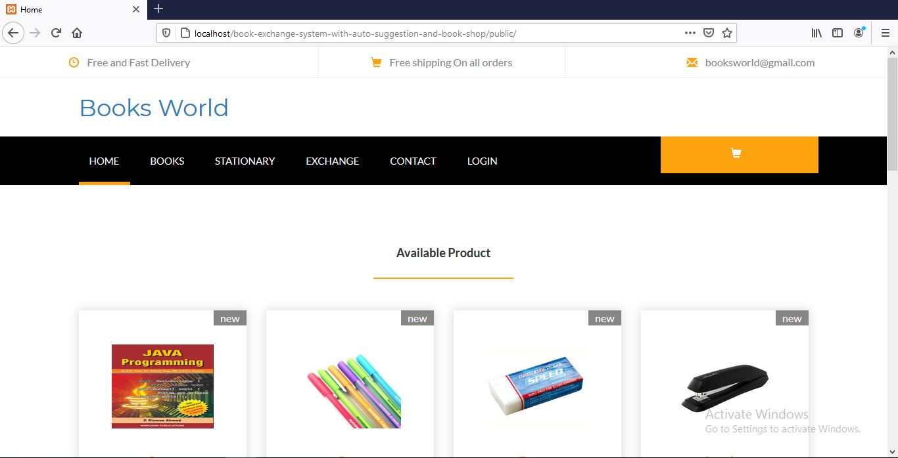

<h2>Book Exchange System with Auto Suggestion and Book Shop</h2>
<h3>(Scroll down to see screenshot of the project)</h3>

This is a book exchange system built with PHP Laravel framework. Users can exchange book between them. User can submit book request after fill up a form. In the form they should mention which book they offer to exchange and which book they want with author name, genre of the book. Also they have to mention whether the offered book is old or new book.

After submitting the request form if any matched offered is available they can see it in the offer post page. If any matched deal is available, then can send exchange request to that matched person. That matched person can see that exchange request in the received request page. If the user interest to that exchange deal, then he/she can accept the request. After accepting the exchange request both users can see their exchange information in the exchanged books page.

The auto suggestion system helps users to find a perfectly matched deal to exchange book. The auto suggestion feature works to match deal depends on various conditions. First of all, the system tries to match same to same book that one is offering and other is requesting. If same to same match is not available then it checks and try to match according to same genre, same author of the book.

There is also book shop feature available in this application. That means users can also buy product.

To use all these features users should register/login.

This project is built with PHP Laravel framework which maintain MVC design pattern. Forms of this project is properly validated. Middleware are used to verify different requests.

<h3>Screenshots of different features and pages of this application given below.</h3>
<h3>Home page</h3>

<h3>Book exchange system</h3>

<h3>Register book button</h3>

<h3>login-registration page</h3>

<h3>Book exchange form</h3>

<h3>Offer Post button</h3>

<h3>Offer post</h3>

<h3>send request button</h3>

<h3>send request</h3>

<h3>after sending request</h3>

<h3>list of sent request</h3>

<h3>received request button</h3>

<h3>list of received request</h3>

<h3>Exchanged books button</h3>

<h3>list of exchanged book</h3>

<h3>Category product</h3>

<h3>admin panel</h3>

<h3>add category page</h3>

<h3>manage category page</h3>

<h3>add product form</h3>

<h3>manage product</h3>

